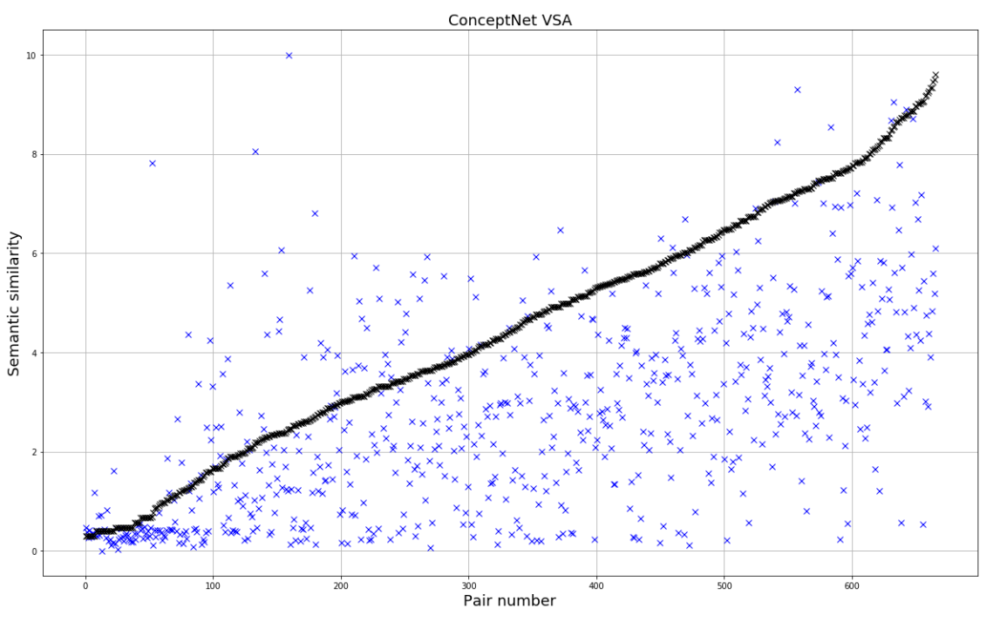
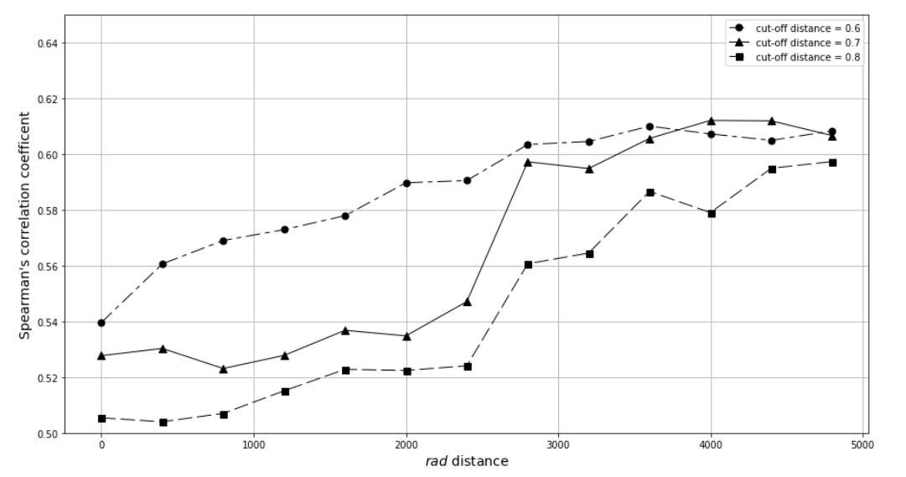

# VSA_conceptnet_repr

Concept representation model using Vector Symbolic Architectures

## Description.

This repository includes all the files developed for the (under review) paper "Semantic Similarity Estimation using Vector Symbolic Architectures".

Vector Symbolic Architectures are a family of methods that use high-dimensional vectors to represent objects: concepts, trees, sequences, etc. In this work we selected a binary VSA called Binary Spatter Codes proposed by Pentti Kanerva. Based on this VSA we designed a model for concept representation that creates "Semantic Pointers" based on a set of semantic features.

We took the idea of semantic pointers from Eliasmith's model Semantic Pointer Architecture. Semantic pointers are vectors used to point to information within a memory system, therefore the term pointer. However, semantic pointers are also 'semantic', which means that the pointers themselves are similar to the information they reference.

We create these semantic pointer based on a set of semantic features, which are words that try to define a concept based on its relations with other words. We obtain the semantic features from the [ConceptNet] (http://conceptnet.io/) knowledge base. In this experiments we use the SimLex-999 dataset to represents its concepts and then compare how our similarity estimation between pairs is approximate to the ranks assigned. 

## File Description

The repository contains two folders: Code and Data. Within Code there are three notebooks: VSA-Experiments, EncodingDataset and HDComputing_basics.

### Notebooks (/Code)
Description of files. All codes were implemented as Python Notebooks.

#### 1) HDComputing_basics
This is an implementation of a Vector Symbolic Architecture (VSA) for a semantic net exploration.
In this notebook a class of objects for hyperdimensional vectors is implemented. It's most important built-int functions are the initialization and the arithmetical operations: addition, multiplication and permutation. It is also described functions for creating, storing and retrieving vectors from memory. 

#### 2) HDComputing_Tests
This notebook makes several experiments using the arithmetic operations defined in the previous notebook. For anyone trying to start learning about operations and the properties of high-dimensional spaces. This is the place to go.

#### 3) Collecting_features.
This notebook shows the basic functions used to request information from the ConceptNet Web API, and then organizing such information as semantic features of the SimLex-999 dataset. 
Running this notebook **can take up to 12 hours**. The ConceptNet Web API limits the number of requests to 1 per second. Nevertheless, in the Data folder we provide the final CSV file (Data/ConceptNet_Semantic_Features) containing all the concepts with its semantic features, so that *running this program is not necesary for the next notebooks to work*. 

#### 4) EncodingDataset
This notebook is one of the most important. It includes the functions needed to enconde the concepts and its semantic features as high-dimensional binary vectors. The functions in this notebook are the gap between the word space to a high-dimensional vector space. 

#### 5) Partitions_and_Distance
This notebook partitions the SimLex-999 pairs. It also measure the pairwise distances between each partition. This information is crucial to clustering process of similar features in the last stage.
We use the Numberbatch embedding as a tool for measuring pairwise distances, which can be downloaded from the [next](https://github.com/commonsense/conceptnet-numberbatch) repository (we use the 17.06/mini.h5 version). 

#### 6) ConceptNet_VSA_AuxFunctions
This notebook defines the auxiliar functions to be used in ConceptNet_VSA, the main notebook of the project.

#### 7) ConceptNet_VSA
**This is the main notebook of the project.** 
It puts together all other functions to encode the SimLex-999 concepts and its semantic features into high-dimensional binary vectors. These vectors are then used to estimate the semantic similarity between each pair in SimLex-999.
In this notebook we also measure the correlation between the similarity estimated by SimLex participants and our model.
We added a cell for measuring similarity using the Numberbatch embedding model. 
This notebook can take **up to 20 minutes to run**, since it performs all the encoding process for each single concept and semantic feature within SimLex-666 (noun subset of SimLex-999). This notebook generates a plotting where each pair has its similarity value according to our model and SimLex: 

#### 8) Parameter_Tunning
This model required to find two parameters from an iterative process, to explore which parameter values work best. The parameters used in the main notebook were obtained throught the iterative process in Parameter_Tunning.
This notebook also takes a long while to execute completely, for demostration purposes we only "iterate" over a single value, and then show a plot showing real results from more complete iteration processes:

#### 9) Demo

### Usage 

### Contributing
Pull requests are welcome. For major changes, please open an issue first to discuss what you would like to change.
Please make sure to update tests as appropriate.

### Authors
Job Isaias Quiroz Mercado. PhD Student at Centro de Investigación en Computación - Instituto Politécnico Nacional - México

### License
[MIT](https://choosealicense.com/licenses/mit/)
